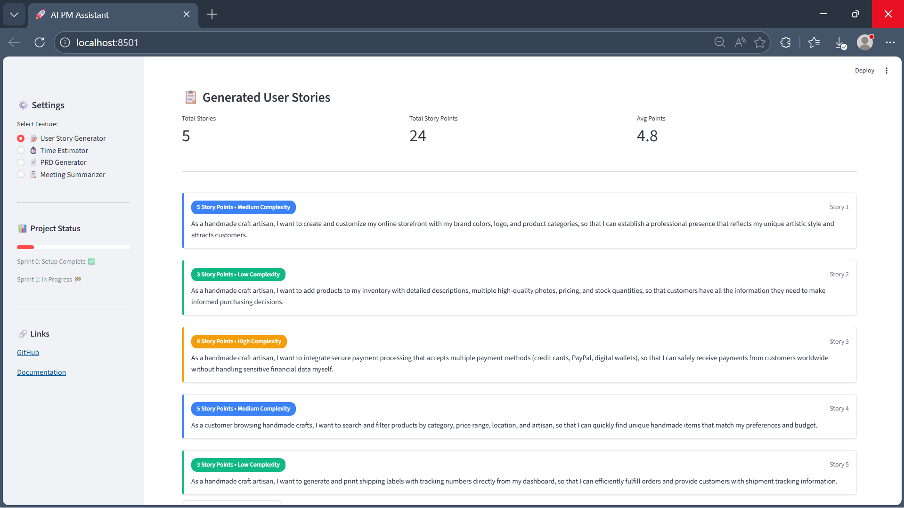

# 🚀 AI PM Assistant

**Automate repetitive Product Management tasks with AI**

## 🎯 Overview

Product Managers spend 30-40% of their time on repetitive documentation:
- Writing user stories
- Estimating timelines  
- Creating PRDs
- Summarizing meetings

This tool automates all of that using AI.

# 🚀 AI PM Assistant

**Live Demo:** [https://ai-pm-assistant-develop.streamlit.app/](https://ai-pm-assistant-develop.streamlit.app/) ⬅️ **Try it now!**

[](https://YOUR-APP-URL.streamlit.app)
[](https://python.org)
[](https://anthropic.com)

> Automate repetitive Product Management tasks using AI. Generate user stories, estimate story points, and streamline your PM workflow.

---

## ✨ Features

- **🤖 AI User Story Generation** - Claude Sonnet 4 generates professional user stories
- **📊 Story Points Estimation** - Automatic complexity assessment (1-13 scale)
- **🎨 Color-Coded Cards** - Visual complexity indicators
- **📥 Export Stories** - Download as Markdown
- **📱 Example Templates** - Fitness, E-commerce, Telemedicine starters

---

## 🎬 Demo



**Try it yourself:** [Live App](https://YOUR-APP-URL.streamlit.app)
## 🛠️ Tech Stack

**AI & ML:**
- Claude Sonnet 4 (LLM)
- LangChain (Orchestration)
- Story Points ML estimation

**Frontend:**
- Streamlit
- Custom CSS styling
- Responsive UI

**Backend:**
- Python 3.10
- Async API calls
- Error handling & validation

**Deployment:**
- Streamlit Cloud
- Environment secrets management
- CI/CD via GitHub

---

## 🏗️ Architecture
```
User Input → Streamlit UI → LangChain → Claude API → Story Generation
                                              ↓
                                      Story Points Estimation
                                              ↓
                                      Color-Coded Display
```

---

## 📊 Project Management

**Methodology:** Scrum (3 one-week sprints)

- 📋 [Project Charter](https://docs.google.com/document/d/1f2DzrDacYLi6blE95NPnwo3imUMu7fdh/edit?usp=drive_link&ouid=115846637859617583108&rtpof=true&sd=true)
- ⚠️ [Risk Register](https://docs.google.com/spreadsheets/d/1_lkiEZ2u6xoJl6QMsy11Bd2XniQSSUGbEXxAenI2KJ0/edit?usp=drive_link)
- 📈 [Sprint 1 Plan](https://docs.google.com/spreadsheets/d/1YCk71K2WLvtIdAXKEUgOinRxcUjYBM7Y/edit?usp=sharing&ouid=115846637859617583108&rtpof=true&sd=true)
- 📊 [Gantt Chart](https://docs.google.com/spreadsheets/d/1YCk71K2WLvtIdAXKEUgOinRxcUjYBM7Y/edit?usp=sharing&ouid=115846637859617583108&rtpof=true&sd=true)
- 🎯 [Jira Board](https://ortegagonzalo.atlassian.net/jira/software/projects/AIPMA/boards/34/backlog?atlOrigin=eyJpIjoiNTY0YTA1YTBiZDBmNDA0ZDhjZmY2OWZkNWJkOTMzYTEiLCJwIjoiaiJ9)

**Sprint 1 Results:**
- ✅ User story generation working
- ✅ Story points estimation
- ✅ Deployed to production
- ✅ Tested with beta users
- ✅ 13 story points delivered

---

## 🚀 Getting Started

### Prerequisites

- Python 3.10+
- Claude API key (from Anthropic)

### Installation

1. Clone the repo:
```bash
git clone https://github.com/your-username/ai-pm-assistant.git
cd ai-pm-assistant
```

2. Create virtual environment:
```bash
python -m venv venv
source venv/bin/activate  # On Windows: venv\Scripts\activate
```

3. Install dependencies:
```bash
pip install -r requirements.txt
```

4. Create `.env` file:
```bash
ANTHROPIC_API_KEY=your-key-here
LLM_PROVIDER=claude
MODEL_NAME=claude-sonnet-4-20250514
```

5. Run the app:
```bash
streamlit run src/app.py
```

6. Open http://localhost:8501

---

## 📈 Future Roadmap (Sprint 2+)

- [ ] RAG with document upload (Pinecone)
- [ ] Time estimation feature
- [ ] PRD generator
- [ ] Meeting notes summarizer
- [ ] Jira integration
- [ ] Multi-language support

---

## 👤 Author

**Gonzalo Ortega**  
Product Manager & AI Engineer  
Copenhagen, Denmark

- LinkedIn: (https://www.linkedin.com/in/gonzalo-ortega-253228158/?locale=es)
- GitHub: (https://github.com/gonzaloortega1993/)

---

## 📄 License

MIT License - see [LICENSE](LICENSE) file

---

## 🙏 Acknowledgments

- Anthropic for Claude API
- Streamlit for amazing framework
- LangChain for LLM orchestration

---

**⭐ Star this repo if you found it useful!**